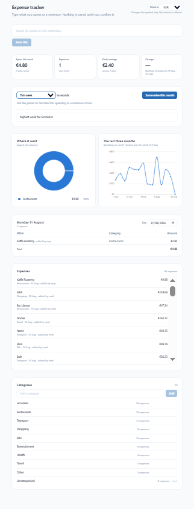

# AI expense tracker

Type an expense as a sentence. An AI reads it, shows you what it understood, and you confirm
before anything is saved.

---



<sub>Sample data, in euros — the currency is chosen on first run, so yours may read
differently. The period is set to <strong>This week</strong> here, which is why the totals are
small and the pie has a single slice; the trend line covers three months whatever the period
is. The two AI panels are empty in this shot — the summary and the answer appear once you
press the button or ask something. Rows say where they came from when it was not this page —
<code>added by mcp</code>, <code>added by seed</code> — which is the <code>source</code> column
described further down.</sub>

---

## What it does

You write "spent 42 euros at Lidl yesterday" into a box. The backend hands that sentence to
an AI parser, which returns a *suggestion*: an amount, a currency, a merchant, a category and
a date. The page shows that suggestion as editable chips so you can correct anything it got
wrong, and only when you press confirm does the browser call the ordinary, validated endpoint
that writes a row.

Below the box is a dashboard. A dropdown chooses the period it describes — day, week, month,
quarter, half year, three quarters or year — and the cards, the pie and the written summary
all follow it. The cards show the total against the same number of days immediately before
that period; the pie shows where the money went, and clicking a slice opens the expenses
behind it. Alongside them: a fourteen-week trend line, a table of any single day you pick,
every expense in a list that scrolls inside its own box, and a panel for adding, renaming and
deleting categories.

A button asks the AI to describe the period in a sentence or two, and a box below it answers
specific questions — *"highest week for groceries"* — by turning them into a query the
database runs, rather than letting a model near the arithmetic. Any row in the list can be
corrected in place or deleted. You pick your currency the first time you open the app, from
all 162 ISO 4217 codes; changing it later moves no stored number.

An MCP server lets an outside AI assistant query the same data, add expenses and correct
them, through the same API a browser uses.

## Architecture

```
                    ┌───────────────────────────────────────────────┐
                    │  docker compose                               │
                    │                                               │
  browser ──────────┼─▶ web ──── /api/* ──▶ backend ────▶ db        │
                    │   Caddy              Fastify       Postgres   │
                    │     │                                         │
                    │     └── everything else: the built React app  │
                    └───────────────────────────────────────────────┘
                            ▲
                            │ HTTP, the same public API
                            │
  an MCP client ───▶ mcp server
                     stdio, runs on your own machine,
                     not in docker compose — see below
```

Three containers. Only the web container is reachable from outside Docker: the backend
publishes no port of its own, so every request — from the browser, from curl, from the MCP
server — arrives through the same front door. Postgres is published to `127.0.0.1` only, so
a backend running outside Docker can still connect while the database stays unreachable from
anywhere else.

That diagram is the Docker setup. The same code also deploys to Vercel and Supabase, in a
shape that looks different and behaves almost identically — see [Deploying it: two
ways](#deploying-it-two-ways).

## The stack

| Piece | What | Why |
|---|---|---|
| Backend | TypeScript, Fastify, Drizzle, PostgreSQL, Zod | Zod validates every input crossing a boundary. Money is `numeric(12,2)` — a decimal column, never a float. Every row stores what was spent and its value in the base currency. |
| Frontend | TypeScript, React, Vite, Tailwind, Recharts | One page, no router. Light theme, one accent colour. Two columns from 1280px. |
| AI | `@anthropic-ai/sdk`, `openai`, and an offline mock | One `ExpenseParser` interface, three implementations, chosen by an environment variable. |
| MCP | `@modelcontextprotocol/sdk` over stdio | Seven tools, each calling the backend's HTTP API rather than the database. |
| Serving | Caddy | Serves the built frontend, proxies `/api`, and obtains HTTPS certificates by itself. |
| Exchange rates | Frankfurter (ECB data) | Free, no key, history back to 1999. Cached for 24 hours, with a static fallback table. Switched off by default — see below. |

## Running it locally

You need Docker. Two commands:

```bash
cp .env.example .env          # Windows PowerShell: Copy-Item .env.example .env
docker compose up -d --build
```

Then open **http://localhost**.

No API key is needed and nothing in `.env` needs editing first — see [It runs with no API
key](#it-runs-with-no-api-key). The backend applies its own database migrations every time it
starts, so there is no separate setup step.

The app starts with an empty database. To load the demo data — one user and 93 expenses
spread over three months, generated from a fixed random seed so it is identical every time.
One expense in every category always lands in the current calendar month, so seeding on the
first of a month does not open a dashboard with nothing in it:

```bash
docker compose exec backend node dist/db/seed.js
```

That script **deletes every existing expense** before it writes, which is why it refuses to
run unless `ALLOW_SEED=true` is set. `.env.example` sets it.

Useful afterwards:

```bash
docker compose logs -f          # watch all three containers
docker compose ps               # health of each
docker compose down             # stop, keeping the database
docker compose down -v          # stop and delete the database too
```

## Deploying it: two ways

This repository deploys two different ways, and both are kept working. Adding the second one
changed nothing about the first — the Dockerfiles, `docker-compose.yml` and the `Caddyfile`
are untouched.

| | Docker on a VPS | Vercel + Supabase |
|---|---|---|
| Frontend | Caddy serves the built files | Vercel serves them |
| Backend | one Fastify process, running for months | a serverless function, started when a request arrives |
| Database | a Postgres container beside it | Supabase, reached through a connection pooler |
| Migrations | applied automatically on every container start | applied by you, from your own machine |
| HTTPS | Caddy fetches a certificate from Let's Encrypt | Vercel provides one |

**The application code is identical in both.** `backend/src/app.ts` builds the Fastify app and
registers the six route plugins. The only thing the two ways disagree about is who opens the
port: `backend/src/index.ts` calls `listen()` and is what Docker runs, while
`backend/api/index.ts` never listens at all and hands each request Vercel gives it to that
same app. Not one route, schema or query differs between them.

Every `/api` path reaches that one function because `backend/vercel.json` says so, with a
rewrite from `/api/(.*)`. It is worth doing explicitly: naming the file `api/[...path].ts` and
relying on a catch-all filename does not work here — that convention belongs to Next.js, and
plain Vercel function routing reads the brackets as a single dynamic segment, so nested paths
like `/api/analytics/summary` never arrive. A rewrite only chooses which function answers; the
original URL is passed through untouched, which is what lets Fastify's router see exactly what
it sees under Caddy.

### Vercel and Supabase

```
  browser ──▶ vercel project: frontend ──── /api/* ──▶ vercel project: backend ──▶ supabase
              the built React app,          rewrite     api/index.ts,             postgres,
              served as static files                    one serverless function    via the
                    ▲                                        ▲                     pooler
                    │                                        │
                    └── one origin, so no CORS               │ HTTPS, the same public API
                                                             │
  an MCP client ─────────────────────────────────────────────┘
                     stdio, still running on your own machine
```

Two Vercel projects from the same repository, because Vercel deploys one directory at a time.
The frontend project rewrites `/api/*` to the backend project, so the browser still talks to a
single address — exactly the job Caddy does in the other setup, and the reason there is no CORS
configuration anywhere in this repository.

**1. Create the database.** Sign in at [supabase.com](https://supabase.com) and create a
project. It asks for a name, a **database password** — let it generate one and save it
immediately, because it is part of the connection string and is not shown again — a region,
and a plan. Free is enough. Choose a region near you; this app is built around
`Europe/Helsinki`, so Frankfurt is a sensible default.

When it has finished provisioning, press **Connect** and copy two of the three strings it
offers:

| String | Port | Use it for |
|---|---|---|
| Direct connection | 5432 | nothing here — it is IPv6-only, and Vercel cannot reach it |
| Session pooler | 5432 | migrations and seeding, from your own machine |
| **Transaction pooler** | **6543** | **the deployed app** |

**2. Apply the migrations.** There is no container start to hang them off, so you run them
once, yourself, pointed at Supabase. Use the **session** string — schema changes are several
statements that want a connection which stays put:

```bash
cd backend
DATABASE_URL="<session pooler string>" DB_SSL=require npm run db:migrate
```

In PowerShell on Windows, environment variables are set on their own lines first:

```powershell
cd backend
$env:DATABASE_URL = "<session pooler string>"
$env:DB_SSL = "require"
npm run db:migrate
Remove-Item Env:DATABASE_URL, Env:DB_SSL   # so the next local run is local again
```

A variable set in the shell wins over the same name in `.env` — `process.loadEnvFile` does
not overwrite what is already there. That is what stops this from quietly migrating your
local database while you watch a Supabase-shaped command scroll past.

This is the same Drizzle migrator the Dockerfile runs, reading the same SQL files in
`backend/src/db/migrations`. It records what it has applied, so running it again does nothing.
Run it the same way after any future `npm run db:generate`.

Loading the demo data is separate, and **deletes every existing expense first**:

```bash
ALLOW_SEED=true DATABASE_URL="<session pooler string>" DB_SSL=require npm run db:seed
```

Or in PowerShell:

```powershell
cd backend
$env:ALLOW_SEED = "true"
$env:DATABASE_URL = "<session pooler string>"
$env:DB_SSL = "require"
npm run db:seed
Remove-Item Env:ALLOW_SEED, Env:DATABASE_URL, Env:DB_SSL
```

Migrations are deliberately not wired into the Vercel build. A build runs on every deploy and
two can run at once, which makes it a poor place to be changing a schema.

**3. Deploy the backend.** Import this repository at [vercel.com](https://vercel.com) with
**Root Directory** set to `backend`. `backend/vercel.json` handles the rest. Set these
environment variables on the project:

| Variable | Value |
|---|---|
| `DATABASE_URL` | the **transaction pooler** string, port 6543, exactly as Supabase gives it — no `sslmode` on the end |
| `DB_POOL_MAX` | `1` |
| `DB_SSL` | `require` |
| `AI_PROVIDER` | `mock` |
| `FX_CONVERSION` | `off` |

There is deliberately no `TZ` here. Vercel rejects it as a reserved name, and the app does not
want it: `lib/dates.ts` names `Europe/Helsinki` explicitly and every date decision goes through
that, precisely so the machine's clock settings cannot change what day an expense lands on.
Under Docker `TZ` is still set, where it costs nothing and makes container logs readable — but
nothing has ever read it. `/api/health` reports the time zone it is actually using, which is
how you can tell.

No key is needed; the app runs on the mock parser exactly as it does locally. Deploy, then open
`/api/health` on the address Vercel gives you. It should say the database is reachable.

**4. Deploy the frontend.** Import the same repository again with **Root Directory** set to
`frontend`, then edit `frontend/vercel.json` and replace
`REPLACE-WITH-YOUR-BACKEND-PROJECT.vercel.app` with the backend's real address. Commit, and it
redeploys. That one line is what makes `/api` on the frontend reach the backend.

**Use the project's production domain, not the URL from a deployment.** Vercel hands out three
kinds of address, and only two of them are stable:

| Address | Stable? |
|---|---|
| `project-a9hcvbza7-scope.vercel.app` | **No.** The middle part is a per-deployment hash — a new one every single deploy. |
| `project-git-master-scope.vercel.app` | Yes, follows the branch. |
| `project-scope.vercel.app` | Yes, always points at the current production deployment. This is the one to use. |

Hardcoding a deployment URL here works exactly once, then breaks silently the next time the
backend is deployed — the frontend keeps rewriting to an address that still exists and still
answers, but is running last week's code. Project settings, under Domains, name the stable one.

Also check **Deployment Protection** on the backend project. If it covers production, the
rewrite arrives without a Vercel login cookie and gets a redirect to a sign-in page instead of
JSON, which reaches the browser as "could not reach the server" — a confusing symptom for a
setting nobody remembers turning on.

**5. Point the MCP server at it.** One line in `.env`:

```
BACKEND_URL=https://your-frontend-project.vercel.app
```

The frontend's address, not the backend's, so the MCP server arrives through the same front
door a browser does.

### Why the transaction pooler, and not the first string Supabase offers

A connection pool keeps a few connections to Postgres open and reuses them. That is right for
one container serving every request. It is wrong on Vercel, where the same module is loaded by
as many function instances as the platform decides to start, each with a pool of its own.
Postgres has a hard connection limit, and past it new connections are simply refused — under
exactly the load you would want the app to survive.

Supabase runs a pooler called Supavisor in front of the database for this. In **transaction
mode**, port 6543, a real Postgres connection is borrowed only for the length of a single
transaction and handed straight back, so a large number of clients share a small number of
connections. `DB_POOL_MAX=1` on top of that stops each instance holding ten connections it
cannot use, since it only ever serves one request at a time.

There is a second reason it is not optional: Supabase's direct connection is IPv6-only on the
free plan and Vercel's functions are IPv4, so the direct string cannot connect at all.

Transaction mode has one real constraint — it does not support protocol-level prepared
statements. Neither node-postgres nor Drizzle uses them unless you call Drizzle's `.prepare()`,
and nothing here does. Ordinary transactions are unaffected: `renameCategory()` runs two writes
in one transaction and works normally, because a transaction pins a connection for its duration
by design.

`DB_SSL=require` encrypts the connection but does not check the certificate, which is what
Supabase accepts with no further setup. That is worth being plain about: nobody can read the
traffic in transit, but nothing proves the machine answering is the one you meant.
`DB_SSL=verify` is stricter, and works once Supabase's certificate authority is installed on
the machine making the connection.

### What behaves differently once it is deployed this way

- **The first request after a quiet spell is slow.** Nothing is running until a request arrives
  — a "cold start". Vercel keeps an instance warm afterwards.
- **The exchange rate cache is per instance.** `backend/src/fx/rates.ts` holds its rates in a
  `Map`, and there are now many copies of it. Nothing goes wrong: entries are keyed by date and
  currency pair and a historical rate never changes, so the worst case is more calls to
  Frankfurter. With `FX_CONVERSION=off` — the default — that code does not run at all.
- **Each MCP tool call becomes several function calls.** The MCP server reads the categories
  and the base currency fresh every time, deliberately, so one `add_expense` is three requests.
  Its timeout went from ten seconds to twenty to cover a cold start.
- **`maxDuration` is 30 seconds**, set in `backend/vercel.json`. Vercel's default is 10 and
  `AI_TIMEOUT_MS` defaults to 15 — so with a real API key configured, the default would kill
  the request before the app's own timeout could fall back to the mock.


## Looking at a period other than this one

Every option in the dropdown used to be anchored to today, so there was no way to summarise
July. Two controls now do two jobs: **the dropdown chooses how long a block is** — a week, a
month, a quarter — and **the arrows choose which block of that size**. Seven names in the menu
however far back you walk, rather than fourteen entries in one list.

The current block runs to today. A stepped one is **complete**: August means 1 to 31 August,
because there is nothing partial about a month that is over. That is also what makes the
comparison honest — a whole August against a whole July is like for like. The exact dates are
always written under the control, since neither "This month" nor "August 2026" says where a
partial block stops.

Labels are absolute once stepped — "August 2026", "Q2 2026", "2025" — never "last month".
Relative names are readable exactly once, and "three quarters ago" collides with the period
actually called three quarters.

**Custom range** takes two dates for anything the named periods cannot express, and gets no
comparison. "1 June to 15 July" has a perfectly well-defined stretch before it — the 45 days
ending 31 May — with real spending in it. It is simply a stretch nobody chose, and a percentage
against it invites a conclusion from an accident of arithmetic. The card says so rather than
showing a dash, in the same way it distinguishes "nothing recorded then" from "too little to
compare". Custom ranges have no arrows either: stepping one would have to invent a stride, and
every answer guesses at what somebody who typed two exact dates wanted next.

Everything on the page follows the selection — cards, written summary, question box, pie,
expenses list — **including the trend line, which did not before.** It stays fourteen weeks
wide but now ends where the period ends, so stepping to July shows the fourteen weeks up to 31
July. Both simpler answers are wrong: pinned to today it is one chart on a July dashboard
describing September, and squeezed into the period it draws "today" as a single point.

The calendar is the deliberate exception. It is a month grid with each date showing that day's
total, and it has its own back and forward month arrows, independent of the period stepper —
two controls doing two jobs, so choosing a day in September does not move a dashboard somebody
is reading July on. It names its own month in its heading for that reason. Stepping it leaves
the chosen day where it is: a selected day is a thing somebody picked, not a cursor following
the view.

Clicking a date drives the table underneath it, which answers a different question — what was
spent on one named day — and moving to another day is meant not to refetch the charts. That
table used to carry a date picker of its own; the calendar replaced it and is now the only way
to choose a day.

Its numbers come from `GET /api/analytics/daily` rather than from adding up a month of expenses
in the browser. That mirrors the pie, which has the same two halves: an endpoint for the
aggregate, and plain `GET /api/expenses` for the rows behind whatever you click. Summing in the
browser would have worked and cost almost nothing — the objection is that the app would then
hold two definitions of "what you spent", free to disagree, and could only reach them through
floating-point addition of figures the decimal column exists to keep exact.

A day with nothing in it shows its number and nothing else, never `€0.00`, which would look
like data and bury the days that have something in them. It is still clickable. The days either
side of the month are drawn faintly and are inert, so the grid keeps its shape at the corners
without ever taking you into a month its heading is not totalling.

## The page, and why it is denser than it was

The layout was built for three sections — add something, see the totals, read the history — and
grew to carry ten. Whitespace that read as calm at three read as a long walk at ten, so the page
was widened from 896px to 1280px, the spacing came down by about a third, and from 1280px it
splits into two columns.

The widening is not a separate preference. Two columns inside the old 896px would have given
each about 416px, and 416px is the exact width that once squeezed the pie legend to one letter
per category. Splitting a page and widening it are one decision.

The split starts at 1280px rather than 1024px for a related reason found while building it: at
1024px the wide column is 587px inside its padding, and the calendar grid needs 640px before it
starts scrolling sideways. The grid would have begun scrolling at exactly the window width where
it gained a second column — a card getting narrower as the window gets wider, which is the same
shape as the legend bug. Between 1024px and 1280px the page stays in one column and simply gets
wider, which both the calendar and the pie prefer.

Columns are assigned by how much width a panel needs, not by how important it is. The calendar
needs 640px and the pie wants 576px before its legend can sit beside the chart, so those go in
the wide column with the day's expenses; the trend line, the expense rows and the category list
all read fine at 400px and go in the narrow one.

**Four panels fold away**: the written analysis, the day's expenses, the expenses list and the
categories panel. Only the categories panel starts folded, on a rule worth stating — a panel
starts closed only if it is a tool you go looking for, never if it is information you would
read. A first-time visitor lands on one closed strip, not a page of shut boxes. The charts and
the calendar do not fold at all, because a chart's whole value is being read without being asked
for.

A folded panel keeps its heading and a one-line summary of what is inside — "Expenses · 92
expenses" — so a closed box is a labelled strip rather than a blank one. The analysis card's
header is split from its body so that the period dropdown stays visible when the card is folded:
it governs every number on the page, and a global control that hides itself is a bad control.
Clicking a date in the calendar forces the day panel open, because the calendar is the only way
to reach a day and a click that appears to do nothing is the feature appearing to do nothing.

Which panels you have folded is remembered in `localStorage`. It is per-browser, never reaches
the server, and is read back through a Zod schema like every other input — the text there may
have been written by an older version of this code. Anything that does not parse falls back to
the defaults: a corrupt preference should cost you your layout, not the page.

## The AI safety pattern

**The AI never writes to the database.** This is the rule the whole project is arranged
around, and it is worth more than any single feature in it.

`POST /api/ai/parse-expense` takes a sentence and returns a structured suggestion. It saves
nothing — no row, no draft, no side effect of any kind. The browser displays that suggestion
as editable fields. Only when a person presses confirm does the browser call
`POST /api/expenses`, an ordinary endpoint that validates its body with Zod and knows nothing
about where the values came from.

```
sentence ─▶ parse endpoint ─▶ suggestion ─▶ a person reads it ─▶ confirm ─▶ validated
            (saves nothing)                 and corrects it                 write
```

Three things fall out of this:

- **A wrong guess is a visible correction, not bad data.** Parsers misread sentences. Putting
  a person between the guess and the write turns that weakness into something you can point at.
- **There is exactly one way to write an expense**, and it validates. The web form uses it.
  The MCP server uses it. Nothing has a private back door to the table.
- **The promise is checked, not trusted.** The parse response includes `saved: false`, and the
  browser asserts that field with Zod on every single call.
- **A guess it cannot make is a gap, not a default.** See the section below.
- **All three AI endpoints make the same promise.** `parse-expense`, `monthly-summary` and
  `ask` each return `saved: false`, and each is asserted the same way. Nothing an AI touches
  in this application writes a row.

The `source` column records whether a row came from the web form, the MCP server or the seed
script — so you can prove that an AI assistant really did write to the database, and by which
route.

## What the parser does when it cannot work something out

It says so, and leaves the field empty. That sounds obvious and it is the thing this project has
got wrong three separate times, in three different features, always the same way.

The reported version: **"53 euros for clothes at uniqlo on sept 4" was filed under today.** The
parser had never understood month names, and its answer when it understood nothing was today's
date — a value shaped exactly like a correct one. The confirm step showed it, and there was
nothing there to catch. Compare the pie legend truncating "Bills" to "B", and the trend chart
describing September under a July dashboard: in all three, nothing errored, nothing warned, and
the wrong output looked as deliberate as the right one. The common cause every time is **a
fallback that produces a plausible value rather than an absent one.**

So the date step has three outcomes rather than two:

| The sentence | What comes back |
|---|---|
| Names no date — "42 euros at lidl" | Today, quietly. This is ordinary and correct. |
| Names a date it can read — "on sept 4" | That date. |
| Names something meant to be a date that it cannot read | `null`, and a note saying why. |

The old code had a boolean here, and `explicit: false` meant both "no date was mentioned" and "a
date was mentioned and I could not read it". Collapsing those two is the entire bug, and it was
in the type before it was in the behaviour.

An unreadable date leaves the confirm step's date box **empty, ringed, focused, and refusing to
save**, with the note quoting the text that failed — "“31 february” is not a real date",
"“4 september 2027” is in the future", "“september” names a month but not a day". That is the
same treatment a missing amount has always had. An empty box cannot be scanned past the way a
plausible wrong date can.

### Date formats it reads

Numeric, day first, which is the Finnish convention: `4.9.2026`, `4.9.26`, `4,9,26`, `4/9/26`,
`4-9-26` — the separator must be the same one twice. ISO `2026-09-04`. Relative phrases:
"yesterday", "3 days ago", "last friday", "the day before yesterday".

Month names, English or Finnish, full or abbreviated, in either order, with or without a year:

```
sept 4            4 sept              September 4th        4 September 2026
Sep 4, 2025       1st august          4. syyskuuta         syyskuun 4.
15. joulukuuta 2025                   3. kesäkuuta         3. kesakuuta
```

Finnish months are compounds ending in *kuu*, and a written date puts them in the partitive —
*syyskuuta*. Each month is stored as one stem plus the endings a date takes, so *syys*,
*syyskuu*, *syyskuuta*, *syyskuussa* and *syyskuun* are all one entry. Spellings without the
umlaut are accepted too, because a phone keyboard set to English does not give you ä.

**A day and month with no year mean the most recent occurrence on or before today.** "sept 4"
typed in October is this year; the same words typed in August are *last* September, because
September has not happened yet — and somebody writing an expense is recording something already
spent. A year that was actually written is taken at its word instead: "4 September 2026" typed
in August is reported as being in the future rather than quietly moved to 2025, because
inference is for what somebody left out, not for overriding what they typed.

## It runs with no API key

`AI_PROVIDER` defaults to `mock`: an offline parser built from regular expressions and
keyword rules. It finds a number, guesses a merchant from capitalised words, matches a
category by keyword, and understands simple dates like "yesterday". It is deliberately
imperfect — which is exactly what the confirm step is for.

Clone this repository, set no keys at all, and every part of the app works. Set
`AI_PROVIDER=claude` or `AI_PROVIDER=openai` with the matching key and a real model answers
instead. If that provider errors, times out, or returns something that fails validation, the
request falls back to the mock rather than failing — and the response names the parser that
*actually* answered, not the one configured, because on a fallback those differ.

## Asking questions

Alongside the summarise button there is a box for specific questions — *"biggest expense in
travel"*, *"highest week for groceries"*, *"which month did I spend most on restaurants"*.

**The model picks the question; the database computes the answer.** It is handed the
question, today's date, the category list and the base currency — never an expense row — and
its only job is to fill in one of five shapes:

```ts
| { kind: "unsupported"; reason }      // outside the grammar, said plainly
| { kind: "looksLikeExpense" }         // belongs in the add box
| { kind: "aggregate";   measure, filters }
| { kind: "topExpenses"; order, limit, filters }
| { kind: "topBuckets";  bucket, measure, order, limit, filters }
```

That query is validated with Zod, run as SQL, and written up from a template. **No figure in
an answer was produced by a language model** — which is the same division as the confirm step,
one layer along: there, the AI never writes to the database; here, it never computes the money.

### The boundary, and what happens outside it

The grammar *is* the boundary — what it can express is answerable, and what it cannot is
refused. Declining is a member of the grammar rather than an error path, because a model with
no legitimate way to say no will force a bad fit onto whichever shape is closest and answer a
question about money that nobody asked.

Deliberately out of scope: **why** questions, predictions and budgets, advice, and comparing
one thing against another.

| Situation | What happens |
|---|---|
| Outside the grammar | says so, and says what it *can* do |
| Text that reads as an expense | points at the add box rather than refusing |
| A category that does not exist | 400 naming the ones that do |
| A shop or a date it cannot pin down | refuses rather than answering the wider question |
| A valid query matching nothing | "Nothing matches that" — never `€0.00` |
| A reply that fails validation | 502, the same as the parser |

The last of those rules is the one worth stating twice: **a constraint that cannot be read is
never silently dropped.** Answering the wider question produces a correct figure that answers
nothing that was asked, which is the worst thing this feature could do.

It is enforced in one place, and that place is a *whitelist*: every word of a question must be
something the rules understand, or a category or shop they matched, or the question is
refused naming what was left over. It began as three guards keyed on prepositions — `at X`,
`on X` — and "lowest food expense" walked past all three, because a noun narrows a question
without needing one. A blacklist of the ways a constraint can appear is a list of the cases
somebody thought of. The check runs before any query shape is chosen, so a new shape inherits
it rather than having to remember it.

With no API key the offline rules handle a narrow set of patterns and refuse everything else,
so the refusal paths are the ordinary experience rather than something you only see with a key.

## How a sentence is taken apart

Each step finds the one thing it understands, hands back the exact words it used, and those
words are removed before the next step runs. So no two steps can read the same characters, and
the order runs most-constrained first: date, then amount and currency, then the merchant.

That ordering is why `31,08,26` is read as a date rather than as three hundred and ten thousand.
Both readings are individually correct; only the order decides which wins.

**The merchant is what survives, not what matches.** This is the part that was rebuilt, after
"32 euro netflix sept 5" came back with no merchant at all. The step used to know four shapes a
name could take — after a preposition, two words at the start, a capital letter — and that
sentence fits none of them: the name sits between the amount and the date with nothing marking
it.

That is the query box's bug in a second place. A whitelist of phrasings is only ever as complete
as the imagination of whoever wrote it, and it fails *silently* — a sentence fitting nothing
produces nothing, with no error to notice. So the question was inverted. Once the date, the
amount and the currency have been removed, and the words that say what was *bought* are known,
whatever survives is the name. There is no list of phrasings to walk around, because there is no
list.

### Telling a name from a thing

The category table used to hold "coffee" and "netflix" in one array, as equally good evidence of
a category — which they are. But they are different kinds of word, and that conflation was the
bug underneath the bug:

- **items** are common nouns. They say what was bought: "coffee", "dentist", "cinema".
- **brands** are proper names. They say what was bought *and where*, because the company is the
  shop: "netflix", "lidl", "ikea".

With one list the merchant step could only refuse everything in it. With two, an item word says
"this is not a name" and a brand word says "this is one".

### Splitting the leftover

| The sentence | The name | Why |
|---|---|---|
| `coffee and tea at k market` | K Market | a preposition is the boundary: before it is what was bought, after it is where |
| `s market chocolate 1600,789` | S Market | no marker, so the leading two words, stopping at any word naming a thing |
| `32 euro netflix sept 5` | Netflix | one word left, and it is a brand |
| `20 euro Kotipizza` | Kotipizza | one word left, and it is capitalised |
| `89 eur ikea shelves` | Ikea | a brand is a complete name, so the shelves are what was bought there |
| `cinema tickets 27` | none | it opens with a thing, not a place |
| `Coffee 4 eur` | none | capitalised, but still something you buy |
| `5 constructor` | none | see below |

Two words is the cap when nothing marks where a name ends, because nothing does. "s market
chocolate" gives up "chocolate", which is the right trade — a name with a stray word on the end
is worse than a description missing one, since only the name is shown as a heading.

`description` keeps the whole sentence exactly as typed, so the split only decides what gets
promoted to a name. Nothing a person wrote is lost between typing and confirming.

**What is left ambiguous, deliberately.** A lone unknown lowercase word gets no merchant.
"32 euro kotipizza" for a shop the brand list has never heard of has the identical shape to
"32 euro chocolate", and nothing in either sentence says which is which. Guessing would produce
a merchant that looks exactly as deliberate as a correct one — the same failure as the date
that quietly became today. The confirm step is where a person settles what a rule cannot, and
that is what it is for.

## Scanning a receipt

Photograph a receipt, check what was read against the photo, save it. **The image never leaves
your device.** There is no upload, nothing is stored, and it works with no API key — the text
recognition is WebAssembly running in the browser, and only the lines of text it produces are
sent anywhere.

That is also why this feature exists at all. Receipt photos were deliberately out of scope,
rejected for needing "file uploads and image storage". Doing the reading in the browser means
there is neither, so the objection stopped applying rather than being overruled.

### The problem worth designing around

OCR does not fail politely. It reads `24,90` as `2490` — a perfectly plausible number that is a
hundred times too big — and reports high confidence while doing it, because its confidence is
about how cleanly the pixels matched a glyph, not about whether the number is right. **An
absent field is visible; a wrong one is not.** This project has had that exact failure three
times: a pie legend truncating "Bills" to "B", a chart describing the wrong month, a date
quietly falling back to today. Every time, a fallback produced a plausible value instead of an
absent one.

So the total is not trusted because the engine felt sure. It is checked, arithmetically, against
the rest of the receipt — which states the same fact more than once:

| Check | What it catches |
|---|---|
| The lines add up to the total | `2490` against lines summing to `24,90`; `4,90` against the same |
| The VAT is a known rate of the total | a hundredfold error fails 25.5%, 14% and 10% at once |
| The card line repeats the total | two readings of one number that disagree |

None of those depends on how confident the OCR felt.

### Four verdicts, and four different screens

| Verdict | What you see |
|---|---|
| **Checked** | the total filled in, and which check agreed |
| **Not checked** | the total filled in, marked in amber — nothing on the receipt could confirm it |
| **Disagrees** | **the amount box empty**, both readings offered as a choice |
| **No total** | the amount box empty, saying no line said what the total was |

The third row is the point. A wrong total does not arrive tinted red in a filled-in box, because
a filled-in box gets approved at a glance whatever colour it is. It arrives as *nothing*, the way
a missing amount already does, and both candidate readings sit beside it — "Use 24.90, what it
adds up to" and "Use 2490.00, what was printed" — with neither preselected. When the arithmetic
caught the error it usually also knows the answer, and offering it beats clearing the box to
nothing; both beat filling one in silently.

The second row matters for a smaller reason: "we read a number" and "we checked a number" are
different claims, and showing them identically states the first as though it were the second.

### Verifying, not approving

Typing "24.50 at Lidl" means you already know what you meant. Photographing a receipt means you
may not have read it closely — the figures on screen are the first time you are looking at them
properly. So the photo sits beside the fields with the total, the date and the shop name **boxed
on the image**, using the word positions the OCR returned. You can see the pixels each value came
from. When the total is the thing in doubt, its box is red, so your eye goes to the receipt rather
than to a field that cannot tell you anything.

Values it could not point at are said so plainly rather than left to be assumed complete.

### What it reads

Damaged keywords, because thermal receipts photograph badly: `TOTAL`, `T0TAL`, `TOTAI`, `Totai`,
`YHTEENSÄ`, `YHTEENSA`, `SUMMA`. These are not a list of misspellings — a list of misspellings
works until the next photo. The damage is undone instead: confusable characters folded back
(`0`→`o`, `1`→`l`, `5`→`s`), accents dropped, then compared with a little slack. That covers
spellings nobody has seen yet.

Amounts as Europe writes them — `24,90`, `1.234,56`, `1 234,56`, `€24,90`, `24,90 EUR` — reusing
the same number reader the sentence parser uses. Dates as `04.09.2026`, `4.9.26`, `04/09/2026`,
`2026-09-04`, `4. syyskuuta 2026`, and `04.09.` with no year at all.

**Anything it cannot determine comes back null rather than guessed.** A receipt with no line
saying TOTAL gets no total, and you type it. Picking the largest number on the page and hoping
would produce a figure that looks exactly like a correct one.

### It is still the same door

A scanned receipt reaches the database the way everything else does: `POST /api/expenses`, after
a person presses save. Nothing is ever added silently. The list shows it as `added by receipt`.

### Running it

The engine and the English and Finnish language data are served from this repository — about
31 MB under `frontend/public/tesseract/` — rather than fetched from a CDN, so scanning works
offline and does not depend on a third party staying reachable. The first scan in a browser
downloads only the parts it needs, once, and says so while it does.

All six WebAssembly core variants are vendored, not just the one this machine happened to use.
Tesseract picks between them at runtime on what the browser supports — relaxed SIMD, plain SIMD,
or neither — so which file gets requested is not knowable in advance. Shipping five of the six is
how the first version broke: the browser asked for the relaxed-SIMD build, got a 404, and OCR
never started. A check now reads the list of variants out of tesseract.js's own worker source and
fails if any is missing, so a version bump that adds a seventh is caught here rather than in
somebody's browser.

## The currency is the first question

There is no conversion by default. There is one currency — yours — and you pick it before
anything else happens, on a screen that comes before the dashboard rather than beside it. The
demo expenses are plain numbers, so what they are numbers *of* is the first thing worth
establishing; a total with no symbol in front of it has told you almost nothing.

The choice is remembered against the user, so it is asked once. Afterwards the picker at the
top right changes it, offering all 162 codes ISO 4217 defines.

**Switching currency changes the symbol and nothing else.** No stored figure moves, so going
from EUR to JPY to SEK and back to EUR leaves the database byte for byte where it started.
Re-running the seed resets the question so the first-visit flow can be seen again.

### Conversion is still here, switched off

An earlier version of this converted every foreign amount to a base currency at the European
Central Bank's rate for the day it was spent. All of that code is still in the repository —
the live rate lookup, the 24-hour cache, the business-day fallback for weekend dates, and the
fixed table used when the service cannot be reached. It is behind one environment variable:

```bash
FX_CONVERSION=on    # in .env, then: docker compose up -d backend
```

With it **off** (the default), a currency named in a sentence is ignored and the number is
stored exactly as typed — "30 quid" with a euro base records 30 euros. The currency field
disappears from the interface, because offering a choice that will be ignored is worse than
offering none.

With it **on**, the amount is converted at the rate from the day it was spent, both figures
are kept, and the original currency appears in small text beside any row that was not in the
base. The seed data has no foreign rows any more, so the way to see it work is to switch the
flag on and add one.

Why off by default: conversion made the base currency load-bearing. Changing it had to
rewrite stored figures, which made switching lossy and irreversible. Off, the base is a label,
and a label can be changed as often as you like.

## Categories are editable

They started as a fixed list of nine enforced by a Zod enum, which meant a category could
never be added — the list was compiled in. `build-plan.md` records the change; the
`categories` table is the source of truth now, and the enum is gone.

- **Add, rename and remove** them in the Categories panel, which shows how many expenses
  each one holds. The category dropdown on an expense only *chooses* — one control, one job.
- **Renaming rewrites the expenses too.** An expense stores its category as text rather than
  a foreign key, so there is no cascade to rely on; the rename and the rewrite happen in one
  transaction, and the panel says how many expenses it will touch before you confirm.
- **Delete an expense** from its row in the list, after a confirmation that repeats
  the expense back — amount, merchant, date and category — because the wrong Delete is one
  pixel from the right one.

### Deleting a category that has expenses in it

The panel says how many, and offers two answers:

| Choice | What happens |
|---|---|
| Move to Uncategorised | The expenses stay; only the label goes. |
| Delete them too | The expenses are removed with it. Not undoable. |

There is no default and no third "just do something sensible" option, because both guesses
are bad: one destroys expenses over a tidied label, the other keeps rows somebody meant to
clear out. The API refuses a delete that does not say which — `?expenses=` is required.

`Uncategorised` is a real category rather than an empty value, so charts, filters and totals
need no special case for "no category". It is the one category that cannot be deleted: it is
where the others send their expenses.

### The enum did not get weaker, it moved

Validation used to be `z.enum(CATEGORY_NAMES)` inside `createExpenseSchema`. It is now a
lookup against the table, in the route — a database read, which a synchronous Zod schema is
the wrong place for. The 400 it returns has the same shape, so a caller cannot tell which
kind of check refused it, and does not need to.

## The MCP server runs locally, not in compose

An MCP server exposes tools to an AI assistant. This one has seven: `add_expense`,
`update_expense`, `list_expenses`, `search_expenses`, `get_spending_by_category`,
`get_expense_summary` and `delete_expense`.

It is **not** a container and is **not** in `docker-compose.yml`, and that is deliberate
rather than unfinished. It speaks the stdio transport: the AI client launches it as a child
process on your own machine and talks to it over standard input and output. There is no port
for it to listen on and nothing for a remote server to connect to, so putting it in compose
would produce a container nothing could ever reach. Instead it calls the backend's HTTP API
over the network, exactly as a browser does.

That has a second benefit worth naming. Because every tool goes through the public API, the
validation rules live in exactly one place — the MCP server cannot store an expense the web
form would have rejected, because it uses the endpoint the web form uses.

The tools hold no copy of the category list either. They read `GET /api/categories` on every
call, the same way they ask which currency to report in, so an assistant is never offered a
category the server has stopped recognising. That is guidance, not enforcement: a tool that
was handed something unknown answers with the list that does exist, so the assistant can
correct itself — but the backend refuses an invented category regardless, and going straight
to `POST /api/expenses` with one still returns a 400.

To connect it, build it and point your MCP client at the compiled entry point:

```bash
cd mcp && npm install && npm run build
```

```json
{
  "mcpServers": {
    "expense-tracker": {
      "command": "node",
      "args": ["/absolute/path/to/mcp/dist/index.js"],
      "env": { "BACKEND_URL": "http://localhost" }
    }
  }
}
```

`BACKEND_URL` depends on how the backend is running: `http://localhost` under compose (port
80, through Caddy), or `http://localhost:3000` when running it directly with `npm run dev`.

## The API

```
GET    /api/health
POST   /api/expenses
GET    /api/expenses            from, to, category, minAmount, search, limit, offset
                                category repeats to name several: &category=A&category=B
                                the day view is this, with from and to set to the same date
GET    /api/expenses/:id
PATCH  /api/expenses/:id      change any field; omitted fields are left alone
DELETE /api/expenses/:id
GET    /api/analytics/summary   from, to; defaults to this month, vs the days before it
                                compare=false for a range with no natural predecessor
GET    /api/analytics/categories  from, to; defaults to this month
GET    /api/analytics/daily     from, to; defaults to this calendar month
                                one total per day that has spending; the calendar grid
                                days with nothing in them are absent, not zero
GET    /api/analytics/trend       from, to; weekly buckets, fourteen weeks ending where the period does
GET    /api/categories          the categories, with how many expenses each holds
POST   /api/categories          add one
PATCH  /api/categories/:name    rename it, and every expense filed under it
DELETE /api/categories/:name    remove one; ?expenses=reassign or ?expenses=delete
GET    /api/settings            the currency, whether it was chosen, and the ISO list
PATCH  /api/settings            change it; writes one column and no amounts
POST   /api/ai/parse-expense    sentence in, suggestion out, saves nothing
POST   /api/receipts/read       OCR text in, receipt + suggestion out, saves nothing
                                the image is never sent; it stays in the browser
                                expenseDate is null when a date was meant and
                                could not be read; dateNote says why
POST   /api/ai/monthly-summary  from, to; a period in a sentence or two, saves nothing
POST   /api/ai/ask              a question in, a computed answer out, saves nothing
                                a question that asks two things gets both answered
```

Unknown query parameters are rejected with a 400 rather than ignored, because
`?form=2026-08-01` is a typo, and silently ignoring it produces a chart that looks fine and
answers a different question.

## What is not built

Written down plainly, because a README that quietly implies more than exists is worse than
one that admits the gaps.

- **It is not deployed yet.** Everything above runs under `docker compose` on a laptop, and
  that has been tested from an empty database. The VPS, the sslip.io address and the HTTPS
  padlock are the remaining half of the deployment work and have not been done.
- **There is no login.** One demo user, created by the seed script, looked up on every
  request. `user_id` is never read from a request body, so adding real authentication later
  changes one function rather than every query.
- **The real AI providers have never been run.** The Claude and OpenAI adapters implement all
  three methods against the same Zod schemas, and every one of them has only ever been
  exercised through the mock. There has been no API key on this machine, so "it works with a
  real model" is a claim this repository has not earned.

## Deliberately out of scope

Budgets, recurring expenses, CSV import and multi-user support. All reasonable ideas; all
would make this a bigger project rather than a clearer one.

Receipt photos were on this list until the reasons for keeping them off stopped holding —
see "Scanning a receipt" above. Storing the images still is not planned, and neither is a
table of line items.

## Repository layout

```
.
├── backend/          Fastify API — routes, Drizzle schema, AI adapters, FX
│   ├── src/app.ts    builds the Fastify app; both ways of deploying start here
│   ├── api/index.ts  the Vercel entry point — one file, never listens
│   ├── Dockerfile    multi-stage: compiles TypeScript, ships only the result
│   └── vercel.json   build command and the function timeout
├── frontend/         React single page
│   ├── Dockerfile    multi-stage: vite build, then Caddy serving the files
│   └── vercel.json   SPA fallback, and the /api rewrite to the backend project
├── mcp/              MCP server — seven tools, calls the HTTP API (no Dockerfile)
├── docs/             the screenshot this README opens with
├── Caddyfile         serves the frontend, proxies /api to the backend
├── docker-compose.yml
├── build-plan.md     the full specification
├── learnings.md      every term explained, and why each decision was made
└── progress.md       what is built and what is not
```

`learnings.md` is written for someone learning this as they build it: every term introduced
gets a plain-language explanation, and every real decision gets a row in a table saying what
was chosen and why.
